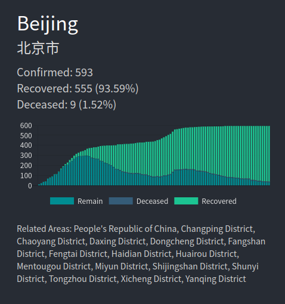
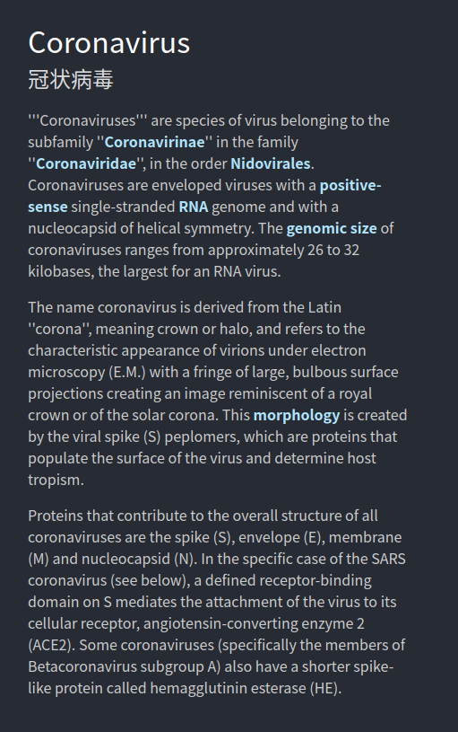

# [COVID-19 Search](https://somefive.github.io/COVID-19-Search/)
#### Author: Da Yin

This project is a front-end website for a search engine designed for COVID-19 related information. Click [here](https://somefive.github.io/COVID-19-Search/) to visit the website.

### Main Features

- Instant Search: Any typings will receive response immediately.
- Advance Search: You may customize the search by changing the page size or sorting metric.
- Event exploration: The related events are calculated by k-nearest neighbors on pre-trained graph embeddings.
- Region Search: Searching for locations such as `Beijing` or `China` will get the infection data.
- Entity Search: Searching for entities such as `Coronavirus` will get the entity knowledge.

### Techniques

Front-end website is bootstrapped with [React Create App](https://github.com/facebook/create-react-app) written in mainly Typescript. The search engine is largely implemented with a simple text search on MongoDB. The segmentation on Chinese texts uses [jieba](https://github.com/fxsjy/jieba).

The back-end services is mainly provided by [AMiner COVID-19](https://covid-dashboard.aminer.cn) including the infection data and the news data. The entity search dynamically calls the API from [XLore](https://xlore.org/).

The related events are calculated using k-nearest neighbor based on graph embeddings generated by ProNE [1]. The graph is constructed by connected news and segmented words.

[1] [Zhang, Jie et al. “ProNE: Fast and Scalable Network Representation Learning.” *IJCAI* (2019).](https://github.com/THUDM/ProNE)